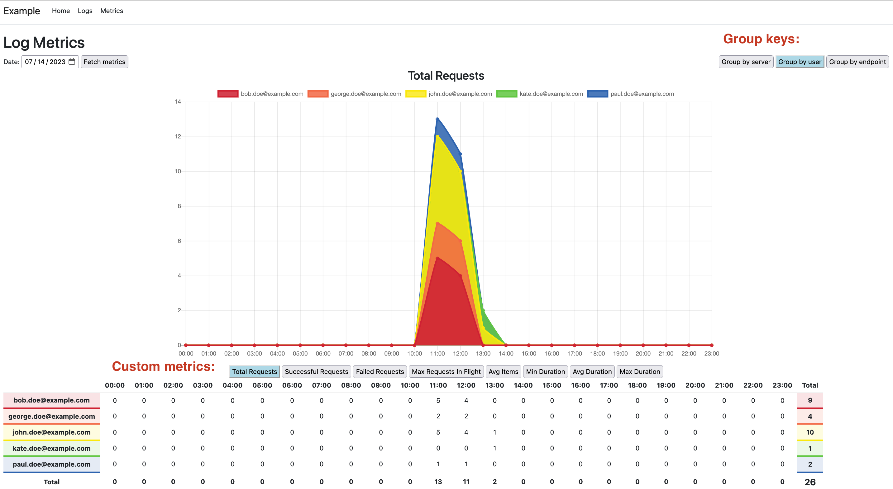

# Ogle
Use Ogle with your asp.net core appplication to view logs or analyze custom request metrics to profile your application's health and performance.
Ogle searches log files saved on your web server or runs a ditributed search on all of your application's web servers in parallel.
The log files do not need to be uploaded to an external log parsing service. Each web application node can save its log files locally.

## Main features
- View log details for a particular request id
- Download an individual log file
- Monitor your app's performance and health via log metrics page



## Getting Started
- Add `Ogle` NuGet package to your ASP.NET Core application
- Add Ogle section to your appsettings.json file
```
    "Ogle": {
        "LogFolder": "logs",
        "LogFilePattern": "Sample-{0:yyyyMMdd}.log",
        "HttpPort": 80,
        "HttpsPort": 443,
        "ServerUrls": [
            "http://localhost:80"
        ]
    }
```
- Define `LogGroupKey`, `LogRecord` and `LogMetrics` classes (refer to the [Example](../Example/) project for details)
  - LogGroupKey defines the properties to group your logs by. For example: Hostname, endpoint, username or time bucket.
  - LogRecord defines the properties that you are interested in harvesting. For example: Number of purchased items, total request time or number of requests in flight
  - LogMetrics defines the aggregate metrics that you want to view. For example: Total requests, Failed requests, Maximum requests in flight etc. These metrics are groupped by the LogGroupKey properties.
- In your startup class register Ogle and define all three classes from above as well as the mapping between LogRecord and LogMetrics via a custom `GroupFunction`.
```
var builder = WebApplication.CreateBuilder(args);

builder.Services.AddOgle(builder.Configuration.GetSection("Ogle"), options =>
{
    options.GroupKeyType = typeof(LogGroupKey);
    options.RecordType = typeof(LogRecord);
    options.MetricsType = typeof(LogMetrics);
    options.GroupFunction = input => input.Select(i =>
        var g = (IGrouping<LogGroupKey,LogRecord>)i;

        return new LogMetrics
        {
            ServerName = g.Key.ServerName,
            Endpoint = g.Key.Endpoint,
            Timestamp = g.Key.Timestamp,
            TotalRequests = g.Count(),
            SuccessfulRequests = g.Count(j => j.Succeeded),
            MaxRequestsInFlight = g.Max(j => j.RequestsInFlight)
            //etc.
        };
    );
});
```
- Ogle adds two new endpoints to your application.
- To search and download logs navigate to `/ogle`
- To view log metrics navigate to `/ogle/metrics`

Call to fetch metrics for a given day will be distributed to all web application nodes, which will parse the logs and return the metrics which will then be displayed on the chart and in the table below.

## Ogle Repository
Parsing request metrics from the logs is a time consuming task - to shorten metrics response times register one of Ogle Repository NuGet packages. 

- Ogle.Repository.File
- Ogle.Repository.MsSqlServer
- Ogle.Repository.MySql
- Ogle.Repository.PostgreSql
- Ogle.Repository.Sqlite

Example repository registration:
```
var builder = WebApplication.CreateBuilder(args);
var configurationSection = builder.Configuration.GetSection("Ogle:RepositorySettings");

builder.Services.AddOgleSqliteRepository<LogMetrics>(configurationSection);
```
To save metrics for a given day to a file or database call

`/ogle/SaveMetricsFromAllServers?date=yyyy-MM-dd`

The endpoint will distribute the request to all web application nodes, the results will be collated and the endpoint will respond with a number of metrics saved. Consequtive calls for the same date will overwrite any possible previous data stored for the same date.

After data is saved, subsequent api calls for log metrics for that date will be read from the repository rather than being calculated on-the-fly from the logs.

Refer to the [Example](../Example/) project for details